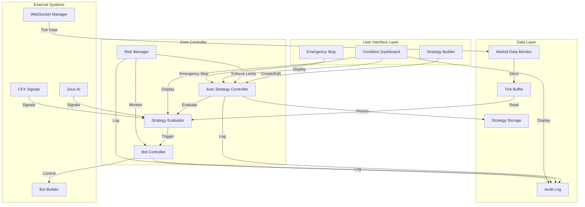

# Auto Strategy Controller - Design Document

## Overview

The Auto Strategy Controller is an intelligent automation system that monitors real-time market conditions and automatically controls trading bot execution based on user-defined conditional strategies. The system enables traders to create IF-THEN rules that start, stop, or switch between bots when specific market conditions, performance metrics, or external signals are met.

### Core Capabilities

- Real-time market data monitoring via WebSocket
- Multi-condition strategy evaluation (digit frequency, volatility, time-based, performance, signals)
- Automated bot lifecycle management (start, stop, switch)
- Risk management with profit/loss limits
- Strategy performance tracking and audit logging
- Template library for quick strategy deployment
- Real-time monitoring dashboard

### Design Principles

1. **Reliability**: Robust WebSocket connection management with automatic reconnection
2. **Performance**: Sub-second condition evaluation and bot control actions
3. **Safety**: Multi-layered risk management with emergency stop functionality
4. **Transparency**: Comprehensive audit logging of all automated actions
5. **Usability**: Intuitive strategy builder with pre-configured templates
6. **Integration**: Seamless integration with existing Bot Builder and WebSocket infrastructure

## Architecture

### System Architecture Diagram



### Component Architecture

The system follows a layered architecture with clear separation of concerns:

1. **UI Layer**: React components for strategy creation and monitoring
2. **Controller Layer**: Core business logic for strategy evaluation and bot control
3. **Data Layer**: WebSocket integration, data buffering, and persistence
4. **Integration Layer**: Interfaces to existing systems (Bot Builder, WebSocket Manager, Signal Providers)

### Data Flow

1. WebSocket Manager receives tick data from Deriv API
2. Market Data Monitor processes and buffers tick data
3. Strategy Evaluator evaluates active strategies on each tick
4. When conditions are met, Bot Controller executes actions
5. Risk Manager monitors and enforces limits
6. All actions are logged to Audit Log
7. Condition Dashboard displays real-time status


## Components and Interfaces

### 1. Auto Strategy Controller (Core Orchestrator)

**Responsibility**: Central coordinator that manages strategy lifecycle and orchestrates all subsystems.

**Interface**:
```typescript
interface IAutoStrategyController {
  // Lifecycle management
  initialize(): Promise<void>;
  start(): Promise<void>;
  stop(): Promise<void>;
  emergencyStop(): Promise<void>;
  
  // Strategy management
  createStrategy(strategy: Strategy): Promise<string>;
  updateStrategy(id: string, strategy: Partial<Strategy>): Promise<void>;
  deleteStrategy(id: string): Promise<void>;
  activateStrategy(id: string): Promise<void>;
  deactivateStrategy(id: string): Promise<void>;
  pauseStrategy(id: string): Promise<void>;
  resumeStrategy(id: string): Promise<void>;
  
  // Status and monitoring
  getStatus(): ControllerStatus;
  getActiveStrategies(): Strategy[];
  getStrategyPerformance(id: string): StrategyPerformance;
  
  // Import/Export
  exportStrategy(id: string): string;
  importStrategy(json: string): Promise<string>;
}
```

**Implementation Location**: `src/services/auto-strategy-controller.service.ts`

**Key Responsibilities**:
- Initialize and coordinate all subsystems
- Manage strategy CRUD operations
- Persist strategies to localStorage
- Handle emergency stop requests
- Coordinate between evaluator, bot controller, and risk manager


### 2. Market Data Monitor

**Responsibility**: Manages WebSocket connection and processes incoming tick data.

**Interface**:
```typescript
interface IMarketDataMonitor {
  // Connection management
  connect(): Promise<void>;
  disconnect(): void;
  subscribeToSymbol(symbol: string): void;
  unsubscribeFromSymbol(symbol: string): void;
  
  // Data access
  getLatestTick(symbol: string): Tick | null;
  getTickBuffer(symbol: string, count: number): Tick[];
  getConnectionStatus(): ConnectionStatus;
  
  // Event handlers
  onTick(callback: (tick: Tick) => void): void;
  onConnectionChange(callback: (status: ConnectionStatus) => void): void;
}
```

**Implementation Location**: `src/services/auto-strategy/market-data-monitor.service.ts`

**Key Responsibilities**:
- Use existing `RobustWebSocketManager` for connection management
- Subscribe to tick streams for symbols used in active strategies
- Maintain rolling buffer of last 1000 ticks per symbol
- Process ticks within 100ms of receipt
- Handle connection failures gracefully
- Notify Strategy Evaluator on each new tick

**Integration with RobustWebSocketManager**:
```typescript
class MarketDataMonitor implements IMarketDataMonitor {
  private wsManager: RobustWebSocketManager;
  private tickBuffers: Map<string, CircularBuffer<Tick>>;
  private subscriptions: Set<string>;
  
  constructor() {
    this.wsManager = new RobustWebSocketManager();
    this.tickBuffers = new Map();
    this.subscriptions = new Set();
    
    this.wsManager.setCallbacks({
      onMessage: this.handleMessage.bind(this),
      onConnected: this.handleConnected.bind(this),
      onDisconnected: this.handleDisconnected.bind(this)
    });
  }
  
  private handleMessage(data: any): void {
    if (data.tick) {
      const tick = this.processTick(data.tick);
      this.addToBuffer(tick);
      this.notifyListeners(tick);
    }
  }
}
```


### 3. Strategy Evaluator

**Responsibility**: Evaluates strategy conditions against current market data and triggers actions.

**Interface**:
```typescript
interface IStrategyEvaluator {
  // Evaluation
  evaluateStrategy(strategy: Strategy, context: EvaluationContext): EvaluationResult;
  evaluateCondition(condition: Condition, context: EvaluationContext): ConditionResult;
  evaluateAllStrategies(strategies: Strategy[]): Map<string, EvaluationResult>;
  
  // Condition evaluators
  evaluateDigitFrequency(condition: DigitFrequencyCondition, ticks: Tick[]): boolean;
  evaluateVolatility(condition: VolatilityCondition, ticks: Tick[]): boolean;
  evaluateTimeRange(condition: TimeRangeCondition): boolean;
  evaluatePerformance(condition: PerformanceCondition, botStats: BotStats): boolean;
  evaluateSignal(condition: SignalCondition, signalData: SignalData): boolean;
}
```

**Implementation Location**: `src/services/auto-strategy/strategy-evaluator.service.ts`

**Key Responsibilities**:
- Evaluate all active strategies on each tick (within 1 second)
- Support AND/OR logic for multiple conditions
- Handle condition evaluation errors gracefully
- Mark conditions as "not evaluable" when data is insufficient
- Calculate digit frequencies from tick buffer
- Calculate volatility (standard deviation) from tick buffer
- Check time ranges with timezone support
- Query bot performance metrics
- Check external signal values

**Evaluation Algorithm**:
```typescript
evaluateStrategy(strategy: Strategy, context: EvaluationContext): EvaluationResult {
  // Check if strategy is in cooldown
  if (this.isInCooldown(strategy)) {
    return { triggered: false, reason: 'cooldown' };
  }
  
  // Evaluate all conditions
  const conditionResults = strategy.conditions.map(condition => 
    this.evaluateCondition(condition, context)
  );
  
  // Check if any condition is not evaluable
  if (conditionResults.some(r => r.status === 'not_evaluable')) {
    return { triggered: false, reason: 'insufficient_data' };
  }
  
  // Apply logic operator (AND/OR)
  const triggered = strategy.logicOperator === 'AND'
    ? conditionResults.every(r => r.value === true)
    : conditionResults.some(r => r.value === true);
  
  return {
    triggered,
    conditionResults,
    timestamp: Date.now()
  };
}
```


### 4. Bot Controller

**Responsibility**: Manages bot lifecycle (start, stop, switch) and integrates with existing Bot Builder system.

**Interface**:
```typescript
interface IBotController {
  // Bot control
  startBot(botId: string, config: BotStartConfig): Promise<BotControlResult>;
  stopBot(botId: string, reason: string): Promise<BotControlResult>;
  switchBot(fromBotId: string, toBotId: string, config: BotStartConfig): Promise<BotControlResult>;
  stopAllBots(reason: string): Promise<void>;
  
  // Bot status
  getRunningBots(): RunningBot[];
  isBotRunning(botId: string): boolean;
  getBotStatus(botId: string): BotStatus | null;
  
  // Queue management
  queueBotStart(botId: string, config: BotStartConfig, priority: number): void;
  getQueuedActions(): QueuedAction[];
  clearQueue(): void;
  
  // Stake management
  adjustStake(botId: string, newStake: number): Promise<void>;
}
```

**Implementation Location**: `src/services/auto-strategy/bot-controller.service.ts`

**Key Responsibilities**:
- Interface with existing Bot Builder system via `run_panel` store
- Start bots using existing bot execution API
- Stop bots gracefully (allow current trade to complete)
- Enforce concurrent bot limits
- Queue bot start actions when limit is reached
- Validate bot existence before starting
- Verify account balance before starting
- Track which strategy started each bot
- Implement cooldown periods between actions
- Log all bot control actions

**Integration with Existing Bot System**:
```typescript
class BotController implements IBotController {
  private runPanelStore: RunPanelStore;
  private runningBots: Map<string, RunningBotInfo>;
  private actionQueue: PriorityQueue<QueuedAction>;
  private maxConcurrentBots: number = 5;
  
  async startBot(botId: string, config: BotStartConfig): Promise<BotControlResult> {
    // Check concurrent limit
    if (this.runningBots.size >= this.maxConcurrentBots) {
      this.queueBotStart(botId, config, config.priority);
      return { success: false, reason: 'queue_full', queued: true };
    }
    
    // Verify bot exists
    const bot = await this.getBotDefinition(botId);
    if (!bot) {
      return { success: false, reason: 'bot_not_found' };
    }
    
    // Check account balance
    if (!await this.hassufficientBalance(config.stake)) {
      return { success: false, reason: 'insufficient_balance' };
    }
    
    // Start bot using existing system
    try {
      await this.runPanelStore.onRunButtonClick();
      this.runningBots.set(botId, {
        botId,
        startedAt: Date.now(),
        startedBy: config.strategyId,
        stake: config.stake
      });
      
      this.auditLog.log({
        type: 'bot_started',
        botId,
        strategyId: config.strategyId,
        stake: config.stake
      });
      
      return { success: true };
    } catch (error) {
      return { success: false, reason: error.message };
    }
  }
}
```


### 5. Risk Manager

**Responsibility**: Enforces profit/loss limits and safety controls across all strategies and bots.

**Interface**:
```typescript
interface IRiskManager {
  // Limit management
  setGlobalProfitTarget(amount: number): void;
  setGlobalLossLimit(amount: number): void;
  setStrategyProfitLimit(strategyId: string, amount: number): void;
  setStrategyLossLimit(strategyId: string, amount: number): void;
  setMaxConcurrentBots(limit: number): void;
  
  // Monitoring
  checkLimits(): RiskCheckResult;
  getCurrentProfit(): number;
  getCurrentLoss(): number;
  getStrategyProfit(strategyId: string): number;
  
  // Actions
  enforceGlobalLimits(): Promise<void>;
  enforceStrategyLimits(strategyId: string): Promise<void>;
  resetDailyCounters(): void;
}
```

**Implementation Location**: `src/services/auto-strategy/risk-manager.service.ts`

**Key Responsibilities**:
- Track cumulative profit/loss across all bots
- Track per-strategy profit/loss
- Enforce global profit targets and loss limits
- Enforce per-strategy profit and loss limits
- Stop all bots when global limits are reached
- Deactivate strategies when strategy limits are reached
- Reset counters at start of trading day
- Validate stake amounts against account balance
- Log all risk management interventions

**Risk Check Algorithm**:
```typescript
async checkLimits(): Promise<RiskCheckResult> {
  const currentProfit = this.getCurrentProfit();
  const currentLoss = this.getCurrentLoss();
  
  // Check global profit target
  if (this.globalProfitTarget && currentProfit >= this.globalProfitTarget) {
    await this.handleGlobalProfitTarget();
    return { action: 'stop_all', reason: 'profit_target_reached' };
  }
  
  // Check global loss limit
  if (this.globalLossLimit && currentLoss >= this.globalLossLimit) {
    await this.handleGlobalLossLimit();
    return { action: 'stop_all', reason: 'loss_limit_reached' };
  }
  
  // Check per-strategy limits
  for (const [strategyId, limits] of this.strategyLimits) {
    const strategyProfit = this.getStrategyProfit(strategyId);
    const strategyLoss = this.getStrategyLoss(strategyId);
    
    if (limits.profitLimit && strategyProfit >= limits.profitLimit) {
      await this.handleStrategyProfitLimit(strategyId);
    }
    
    if (limits.lossLimit && strategyLoss >= limits.lossLimit) {
      await this.handleStrategyLossLimit(strategyId);
    }
  }
  
  return { action: 'none' };
}
```


### 6. Strategy Builder (UI Component)

**Responsibility**: User interface for creating, editing, and managing strategies.

**Component Location**: `src/components/auto-strategy/StrategyBuilder.tsx`

**Key Features**:
- Drag-and-drop or form-based condition builder
- Support for multiple conditions with AND/OR logic
- Bot selection from existing Bot Builder bots
- Stake amount configuration
- Profit/loss limit configuration
- Cooldown period configuration
- Strategy priority selection
- Template selection and customization
- Strategy validation before activation
- Import/Export functionality

**Component Structure**:
```typescript
interface StrategyBuilderProps {
  strategyId?: string; // For editing existing strategy
  onSave: (strategy: Strategy) => void;
  onCancel: () => void;
}

const StrategyBuilder: React.FC<StrategyBuilderProps> = ({ strategyId, onSave, onCancel }) => {
  const [strategy, setStrategy] = useState<Strategy>(defaultStrategy);
  const [validationErrors, setValidationErrors] = useState<ValidationError[]>([]);
  
  return (
    <div className="strategy-builder">
      <StrategyHeader strategy={strategy} onChange={setStrategy} />
      <ConditionBuilder conditions={strategy.conditions} onChange={updateConditions} />
      <ActionBuilder action={strategy.action} onChange={updateAction} />
      <LimitsBuilder limits={strategy.limits} onChange={updateLimits} />
      <StrategyValidation errors={validationErrors} />
      <StrategyActions onSave={handleSave} onCancel={onCancel} />
    </div>
  );
};
```

**Sub-components**:
- `ConditionBuilder`: Add/edit/remove conditions
- `DigitFrequencyConditionForm`: Configure digit frequency conditions
- `VolatilityConditionForm`: Configure volatility conditions
- `TimeRangeConditionForm`: Configure time-based conditions
- `PerformanceConditionForm`: Configure performance conditions
- `SignalConditionForm`: Configure signal-based conditions
- `ActionBuilder`: Configure bot start/stop/switch actions
- `LimitsBuilder`: Configure profit/loss limits
- `TemplateSelector`: Browse and select strategy templates


### 7. Condition Dashboard (UI Component)

**Responsibility**: Real-time monitoring of strategies, conditions, and bot status.

**Component Location**: `src/components/auto-strategy/ConditionDashboard.tsx`

**Key Features**:
- List of active strategies with status indicators
- Real-time condition values and status (true/false/not evaluable)
- Running bots with associated strategies
- Current profit/loss display
- Connection status indicator
- Emergency stop button
- Strategy pause/resume controls
- Manual bot stop controls
- Audit log viewer
- Performance metrics per strategy

**Component Structure**:
```typescript
const ConditionDashboard: React.FC = () => {
  const controller = useAutoStrategyController();
  const [strategies, setStrategies] = useState<Strategy[]>([]);
  const [runningBots, setRunningBots] = useState<RunningBot[]>([]);
  const [conditionStates, setConditionStates] = useState<Map<string, ConditionState>>(new Map());
  
  useEffect(() => {
    // Subscribe to real-time updates
    const unsubscribe = controller.onUpdate((update) => {
      setStrategies(update.strategies);
      setRunningBots(update.runningBots);
      setConditionStates(update.conditionStates);
    });
    
    return unsubscribe;
  }, [controller]);
  
  return (
    <div className="condition-dashboard">
      <DashboardHeader />
      <ConnectionStatus />
      <EmergencyStopButton />
      
      <div className="dashboard-grid">
        <StrategyList strategies={strategies} onPause={handlePause} onResume={handleResume} />
        <ConditionMonitor conditions={conditionStates} />
        <RunningBotsList bots={runningBots} onStop={handleStopBot} />
        <PerformanceMetrics strategies={strategies} />
      </div>
      
      <AuditLogViewer />
    </div>
  );
};
```

**Sub-components**:
- `StrategyCard`: Display individual strategy with conditions and status
- `ConditionStatusIndicator`: Visual indicator for condition state
- `RunningBotCard`: Display running bot with P&L and controls
- `PerformanceChart`: Visualize strategy performance over time
- `AuditLogTable`: Searchable/filterable audit log
- `EmergencyStopButton`: Large, prominent emergency stop control

